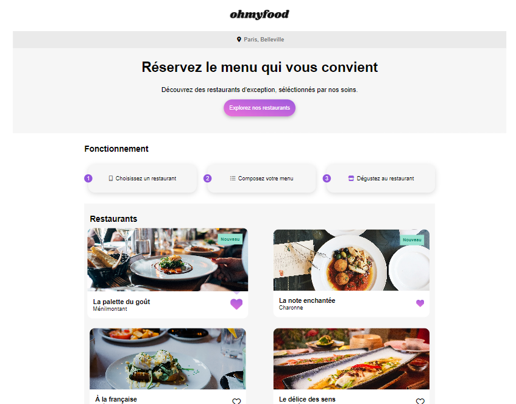
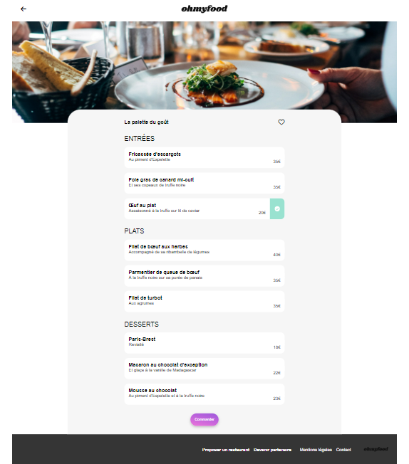

&nbsp;
# OhMyFood

HTML/SCSS/PARCEL

&nbsp;
## Description

This project was a practice project for fun, i wanted to try using SCSS.
If you want to try it => npm run dev

## Overview

## Assessed Skills

- SCSS, Nesting, Mixin, Variable

&nbsp;
